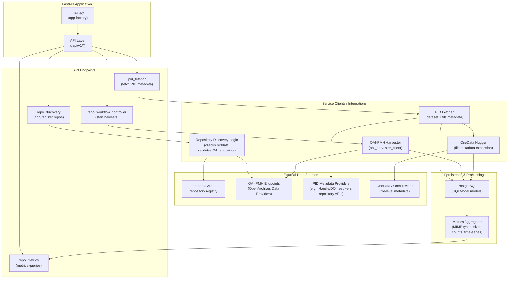

# FileMetrix Service

FileMetrix collects dataset identifiers and file-level metadata from OAI-PMH repositories, stores them in a PostgreSQL database, and exposes REST APIs and metrics for analysis and monitoring.

This repository contains the FileMetrix application, integration clients, and deployment helpers for local development and containerized runs.

Live demo (example): https://filemetrix.labs.dansdemo.nl/docs

---

## Table of contents

- About
- Key features
- Project layout
- Configuration
- Quick start (development)
- Docker / Compose
- HTTP endpoints and health checks
- Logging & observability
- Troubleshooting
- Contributing
- License

---

## About

FileMetrix provides harvesting, storage and query capabilities for dataset and file-level metadata. It is intended for research data platforms and services that need to collect and analyse file-level characteristics (size, MIME type, checksums, embargo/publish dates) and produce metrics across repositories.

The service is implemented as a FastAPI application and uses SQLModel/SQLAlchemy for persistence to PostgreSQL.

---

## Key features

- OAI-PMH harvesting of dataset identifiers and resumption-token handling
- File-level metadata fetching (via PID fetcher integration)
- Storage of repositories, datasets and file metadata in PostgreSQL
- REST API (FastAPI) with public and protected routes
- Metrics and aggregation endpoints (counts grouped by MIME type, sizes, publication-month grouping, per-repository aggregation)
- Optional email notifications for startup, harvest completion and errors
- Health endpoint and Docker Compose integration for local testing

---

## Project layout

Top-level source directory: `src/filemetrix`

- `src/filemetrix/main.py` — application factory, FastAPI initialization and lifecycle
- `src/filemetrix/api/v1/` — API routes (PID fetcher, repo discovery, repo metrics, workflow controller, health)
- `src/filemetrix/infra/` — infrastructure helpers (settings via Dynaconf, database, mail utilities)
  - `infra/commons.py` — centralized settings proxy and `send_mail` implementation
  - `infra/db.py` — SQLModel models and DB helpers
- `src/filemetrix/services/` — service clients (OAI harvester client, PID fetcher integration, oneprovider/OneData helpers)
- `src/filemetrix/utils/` — small utilities
- `conf/` — example and production Dynaconf TOML files

Example tree (abridged):

```
src/filemetrix/
├─ api/
│  └─ v1/
│     ├─ health.py
│     ├─ pid_fetcher.py
│     ├─ repo_discovery.py
│     ├─ repo_metrics.py
│     └─ repo_workflow_controller.py
├─ infra/
│  ├─ commons.py
│  └─ db.py
├─ services/
│  ├─ oai_harvester_client.py
│  └─ onedata_hugger.py
└─ main.py
```

---

## Configuration

Configuration is loaded via Dynaconf from `conf/*.toml` and environment variables. Copy and customize the example config before running in production:

```bash
cp conf/settings.example.toml conf/settings.toml
# or use conf/settings.production.toml as a template
```

Important environment variables (examples):

- `DB_USER`, `DB_PASSWORD`, `DB_HOST`, `DB_PORT`, `DB_NAME` — PostgreSQL connection
- `MAIL_HOST`, `MAIL_PORT`, `MAIL_FROM`, `MAIL_TO` — SMTP settings for notifications (MailDev available for local testing)
- `API_PREFIX` — API route prefix, e.g. `/api/v1`
- `EXPOSE_PORT` — HTTP port (default: 1966)
- `FILEMETRIX_SERVICE_API_KEY` — API key for protected endpoints

For local development the repository includes `.env.example` (copy to `.env`) and `conf/settings.example.toml`.

---

## Quick start — Development

Prerequisites:

- Python 3.12+
- A PostgreSQL instance (local, Docker, or remote) or use Docker Compose below

Install and prepare environment (using `uv` package manager described below) or use standard venv/pip:

- Installing `uv` (the minimal steps):

  - Install via pip (works on Linux/macOS/Windows):

  ```bash
  pip install --user uv
  # or, if you use a virtualenv (recommended):
  pip install uv
  ```

  - macOS (Homebrew) option — install Python via Homebrew then install `uv` with pip:

  ```bash
  # install Python if you don't already have it via Homebrew
  brew install python
  # then install uv
  brew search uv
  brew info uv
  brew install uv
  ```

- With `uv`:

```bash
uv venv .venv
uv sync --frozen --no-cache
```

- Standard venv/pip alternative:

```bash
python -m venv .venv
source .venv/bin/activate
pip install -e .
```

Run the development server with autoreload:

```bash
# from the repository root
make run-dev
# or directly
.venv/bin/uvicorn src.filemetrix.main:app --reload --host 0.0.0.0 --port 1966
```

API docs will be available at: `http://localhost:1966/docs`

---

## Docker / Compose (local integration)

The repository includes a `Dockerfile` and `docker-compose.yaml` to run the service alongside a Postgres and MailDev instance for local testing.

Start services with:

```bash
# builds the filemetrix image and starts containers
docker-compose up -d --build
```

Check logs:

```bash
docker-compose logs -f filemetrix
```

Open MailDev UI to inspect sent emails: http://localhost:1080

Notes:

- `filemetrix` container runs a small prestart validation (`src/filemetrix/validate_env.py`) — the compose setup uses `SKIP_ENV_VALIDATION=1` for local developer convenience but you should unset this for stricter validation in staging/production.
- The Compose file configures a healthcheck for the `filemetrix` container that verifies DB connectivity using `psql` (the `Dockerfile` installs the `postgresql-client`).

---

## HTTP endpoints and health checks

- `/` — root information (hidden from docs)
- `/health` — readiness/liveness check (runs a lightweight `SELECT 1` against the DB and returns 200/503)
- `/docs` — OpenAPI/Swagger UI (auto-generated)

OpenAPI tags are defined in `main.py` and each router is included with a tag and prefix. The `API_PREFIX` setting can be used to add a global prefix if desired.

---

## Logging & observability

- Logging is configured in `main.py` (rotating file handler by default). Configure `LOG_LEVEL` and `LOG_FILE` via env or `conf/settings.toml`.
- [Optional OTLP export can be enabled with `OTLP_ENABLE` and related settings.](https://github.com/DANS-LABS/automated-curation-platform?tab=readme-ov-file#integrating-opentelemetry-protocol-otlp-in-acp)

---

## Troubleshooting — common issues

- AttributeError for settings keys (e.g., `MAIL_USR`): ensure required keys exist in `conf/settings.toml` or as environment variables. The code performs case-insensitive lookups but prefers canonical uppercase env names.
- DB connection failures on startup: verify `DB_HOST`, `DB_PORT`, `DB_USER`, `DB_PASSWORD` and ensure Postgres is reachable. Use the `validate_env.py` CLI to test connectivity:

```bash
python src/filemetrix/validate_env.py --strict --db-wait-timeout 60
```

- Startup email not sent: confirm SMTP settings (`MAIL_HOST`, `MAIL_PORT`, `MAIL_FROM`, `MAIL_TO`) and check MailDev UI (http://localhost:1080). The app retries a few times on startup to allow MailDev to come up first.

---

## Contributing

- Open issues and PRs are welcome. Please run linters/tests and keep changes small and focused.
- Use `make` targets to simplify local tasks (see `Makefile`): `make install`, `make run-dev`, `make compose-up`, `make compose-down`.

---

## License

See the repository `LICENSE` file for license terms.

---

## Architecture (high level)

Intercation of main components and external sources.



- The `FileMetrix` service harvests dataset identifiers via OAI-PMH and stores datasets and file metadata in PostgreSQL. It uses external PID fetcher services and transformer services (configurable) to collect file-level metadata.

---

## Example API calls (curl)

All example calls assume the service runs on `http://localhost:1966` and `API_PREFIX` is `/api/v1` (default).

1. List discovered repositories (re3data cache)

```bash
curl -sS http://localhost:1966/api/v1/repositories | jq '.'
```

2. Fetch repository details (List Sets) from re3data by r3id

```bash
curl -sS http://localhost:1966/api/v1/repository-collections/<r3id> | jq '.'
```

3. PID fetcher: retrieve repository info for a PID

```bash
curl -sS http://localhost:1966/api/v1/repository-info/doi:10.1234/abcd | jq '.'
```

4. PID fetcher: fetch metadata files for a PID

```bash
curl -sS http://localhost:1966/api/v1/doi:10.1234/abcd | jq '.'
```

5. Add a repository (protected route — ensure you include authorization in protected endpoints)

```bash
curl -X POST http://localhost:1966/api/v1/add-repo \
  -H "Content-Type: application/json" \
  -d '{"name": "Example repo", "url": "http://example.org/oai", "metadata_prefix": "oai_dc"}'
```

6. Trigger a dataset harvest by repo id

```bash
curl -X POST http://localhost:1966/api/v1/harvest/1
```

7. Repo metrics: list repositories

```bash
curl -sS http://localhost:1966/api/v1/repos | jq '.'
```

8. Repo metrics: dataset count

```bash
curl -sS http://localhost:1966/api/v1/dataset/count | jq '.'
```

9. Health endpoint

```bash
curl -v http://localhost:1966/health
```

---

## Configuration reference (quick)

A compact table of the most important env vars / Dynaconf keys (see `conf/settings.example.toml` and `docs/CONFIG.md` for more details):

- `API_PREFIX` — default `/api/v1`
- `EXPOSE_PORT` — default `1966`
- `FILEMETRIX_SERVICE_API_KEY` — protect API endpoints
- `DB_USER`, `DB_PASSWORD`, `DB_HOST`, `DB_PORT`, `DB_NAME` — Postgres config
- `MAIL_HOST`, `MAIL_PORT`, `MAIL_FROM`, `MAIL_TO`, `MAIL_USE_TLS`, `MAIL_USE_SSL`, `MAIL_USE_AUTH` — SMTP
- `PID_FETCHER_URL` — URL of PID fetcher service
- `PKL_TOKEN_FILE` — path to store OAI resumption tokens

---
